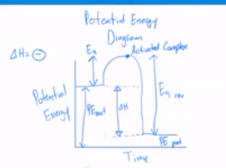

# Reaction

## Reaction Rates

- rate = how fast something occurs

### collision theory

- atoms ions molecules can form chemical bond when they collide if particles have enough kinetic energy + correct orientation

## Potential Energy Diagrams

- PE diagrams = map energy changes over course of chemical reaction

- activation energy = minimum amount of energy colliding particles must have to reorganize

- activated complex = unstable arrangement of atoms that forms top of activation energy barrier

## Speeding up reaction

- shrink container or increase concentration
- increase particle numbers
- speed up particles by adding heat
- break up clumps into individual particles
- use catalyst
